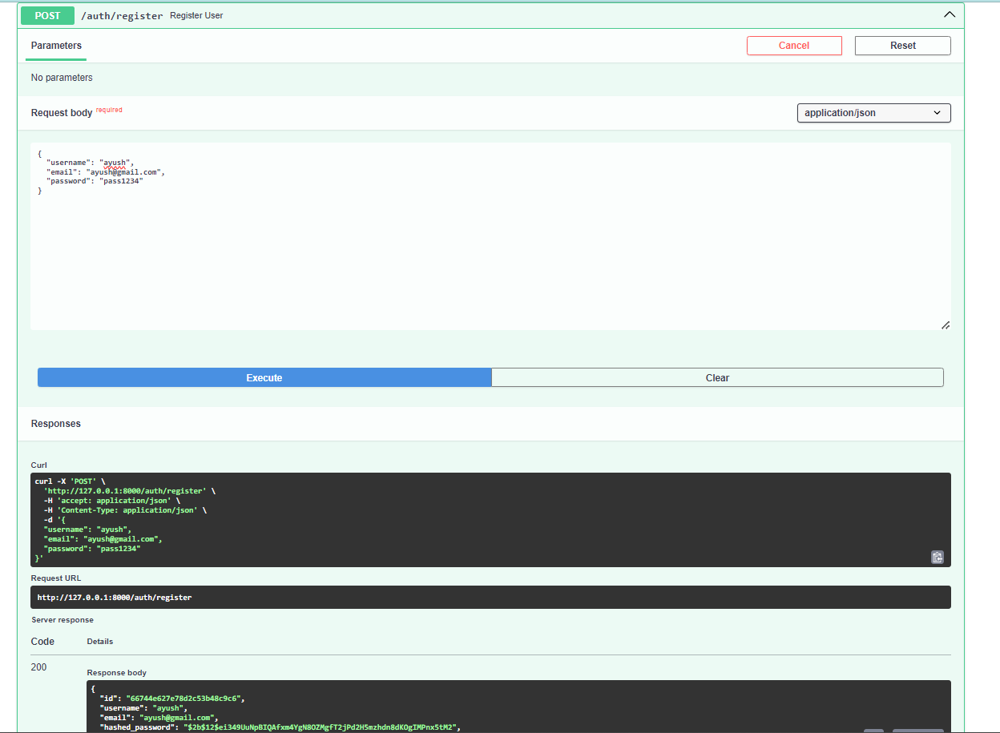
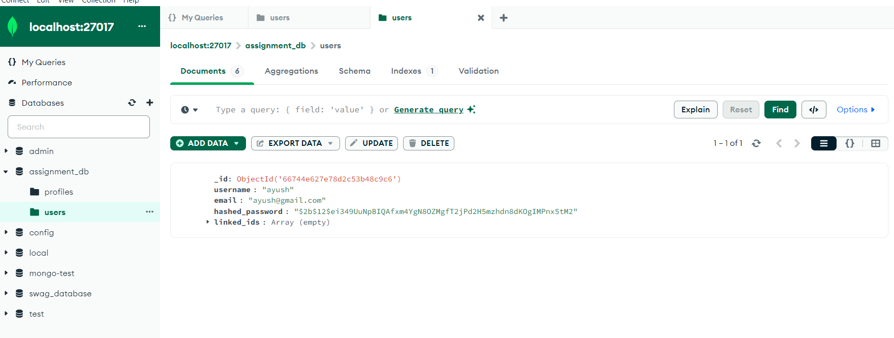
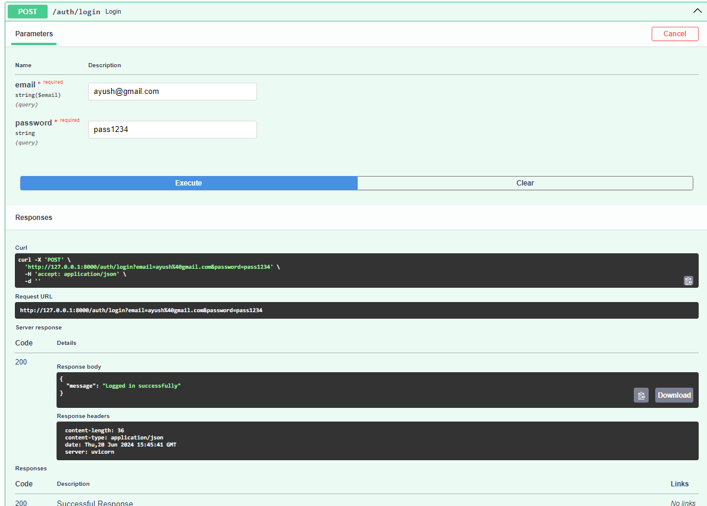
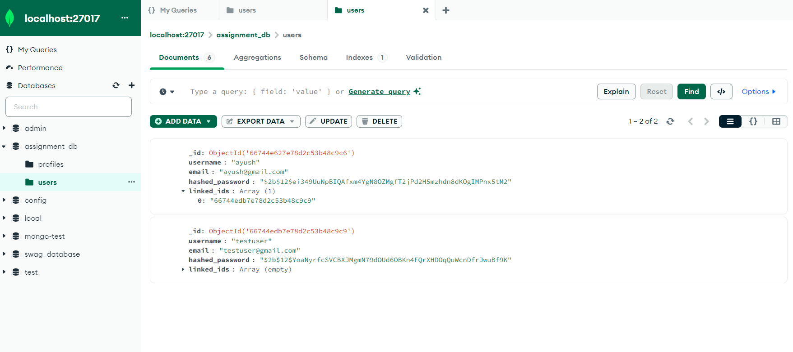
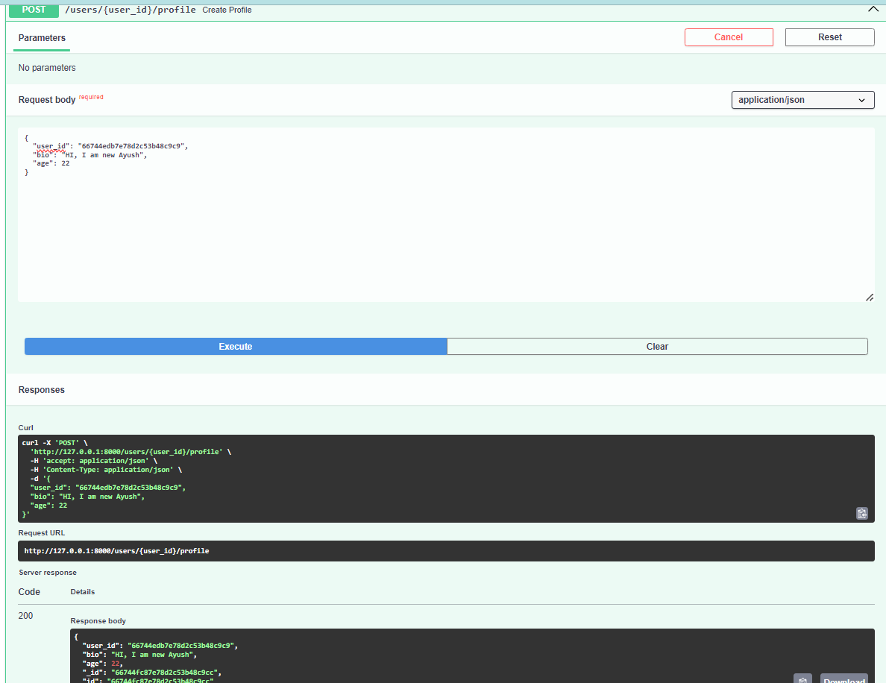
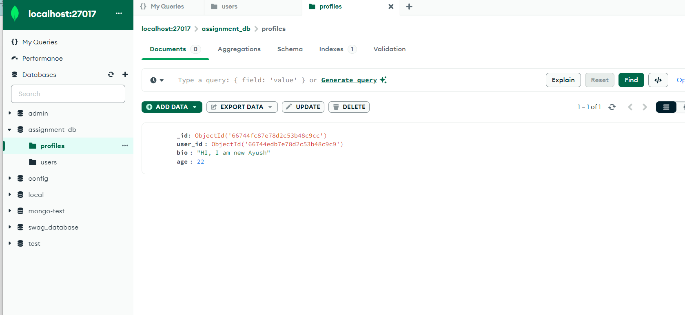
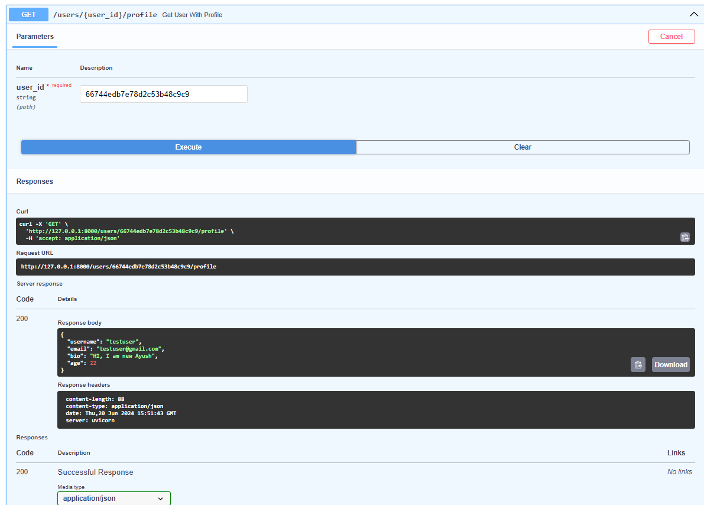
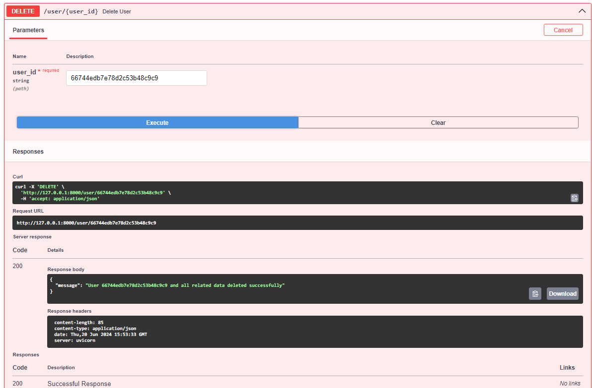
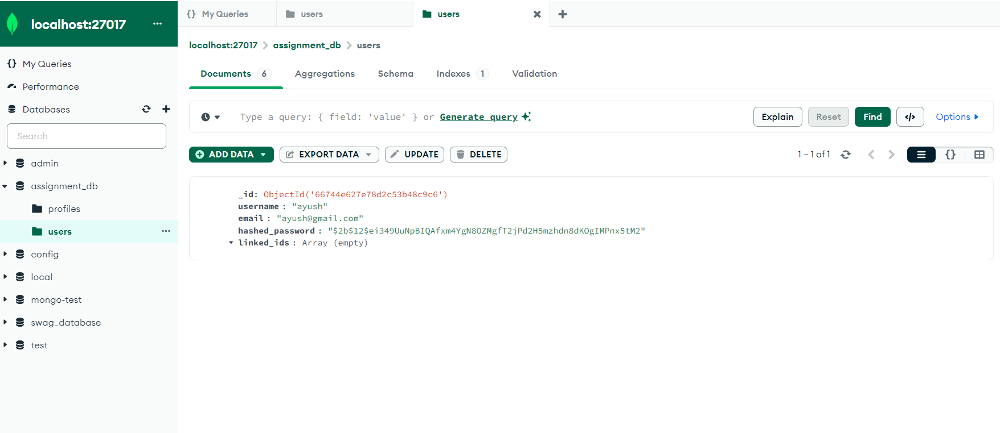

## Developed a set of APIs for user registration, login, linking an ID, and implementing joins and chain delete functionality using Python and MongoDB.

            ##Requirements:

            1. Framework and Libraries:
               - Utilize FastAPI for the web framework.
               - Use PyMongo for interacting with MongoDB.

            2. API Endpoints:
               - Registration API: Endpoint to register a new user.
               - Login API: Endpoint to authenticate an existing user.
               - Linking ID API: Endpoint to link an ID to a user's account.
               - Joins: Implement functionality to join data from multiple collections.
               - Chain Delete: Implement functionality to delete a user and all associated data across collections.

            3. Database:
               - Use MongoDB to store user information.

## Implemented functionality

# User Registration

# User Authentication

# Linking User Id with another User

# Creating user profile

# Linking user profile with user

# Deleting user

# Deleting all User related data ( Profile and Linked Id )

<h2>API Structure</h2>

 
 
 

### User Creating

<h2> User Registration</h2>

 
<h2> User Registration in Database</h2>

 
 
<h2> User Login</h2>

 
 
<h2> Two User in Database for demonstrating Linking ID </h2>

 
<h2>Linked User in Database</h2>

 
 
<h2>Profile Creation</h2>

 
<h2>Profile shown in Database</h2>

 
 
<h2> Profile Linking</h2>

 
 
<h2>Delete User</h2>

 
<h2>Deleted Profile in Database</h2>

 
<h2>Deleted User in Database</h2>

# How to run
 ### clone this repository
 ### open folder and install requirements using `pip install -r requirements.txt`.
 ### run the app using `uvicorn app.main:app --reload`.
 ### test the APIs on `http://127.0.0.1:8000/docs`.

# Hoping for a positive reply from you :).

